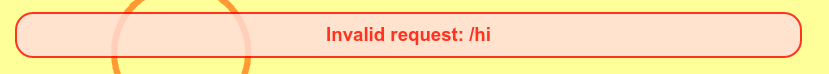
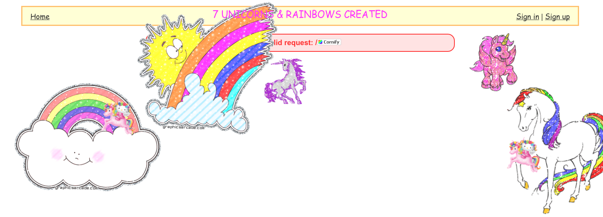

# Sparkle Security Mission 1: Reflected Cornification

Agent Sparkle, your mission, should you choose to accept it, is to bring
more glorious rainbows to the Gruyere web application.  Project Rainbow
cares deeply about adding colour to the world.

## Tools for this mission

1. Your own local Gruyere installation.  See Mission 0 if you have not got this
set up yet.

2. Cornify.com: http://www.cornify.com/  This is a website with code to help you add sparkles and rainbows to any web page.  Project Rainbow approves of their mission.

3. (Optional) Gruyere instructions part 2: https://google-gruyere.appspot.com/part2#2__cross_site_scripting  This mission is based on the section called "Reflected XSS"

## Reflected XSS for great rainbows

XSS stands for "Cross Site Scripting" which is a type of web vulnerability that
will serve you well, Agent Sparkle.  This vulnerability allows a clever agent
to insert her own code into a web page.  This code can modify the page in
ways that its creators never imagined, which makes it great for adding more
rainbows.

"Reflected" XSS means that the code you stealthily inject into your web page
isn't saved, so it won't affect every vistor, but you can cleverly change the
link in order to make it affect people who visit the link you choose.

Don't be fooled into believing that reflected XSS isn't a powerful tool, Agent Sparkle!  Clever agents can often convince people to visit links, sometimes
without them even clicking anything!  You'll learn more about those skills
later, but let's start by making some rainbows!

## Rainbow payload

Agent Sparkle, for this mission we want you to use the cornify code as your payload.  A "payload" according to the Merriam-Webster is...

> "the load carried by a vehicle exclusive of what is necessary for its operation; especially :  the load carried by an aircraft or spacecraft consisting of things (as passengers or instruments) necessary to the purpose of the flight"

So how does this make sense in the context of your mission?  Payload is also
used in security to refer to the code that does the interesting part of your
mission.  In our case, the interesting part of the mission is all about adding
rainbows!

We're using the cornify code as our payload, because it's already designed
to help you add rainbows.  You can write your own code for this too, and you will in later missions, but this is mission 1 and Project Rainbow wants you to have some sparkling fun.


The code that cornify uses looks like this:

```
<a href="http://www.cornify.com" onclick="cornify_add();return false;"></a><script type="text/javascript" src="http://www.cornify.com/js/cornify.js"></script>
```

It's HTML code that inserts a button that will let you add rainbows!

## Find a hole

Agent Sparkle, if you want a big challenge, you can work on some reconnaissance here: start the gruyere web application and see if you can figure out a place where it's vulnerable to code injection.  Stop reading the rest of this section and see if you want to find it yourself!

Probably, though, you're doing mission one and you'd like a bit more help than just "there's a hole here."  So let's talk about how to find this one!

The Gruyere tutorial has a hint:
>  What does this code do? http://google-gruyere.appspot.com/123/invalid

But if you do that on your local machine (i.e. replace
google-gruyere.appspot.com with 127.0.0.1:8008 ) you'll find that actually
turns off gruyere.  This doesn't help with your mission, although it does help
with your opsec because it means that it's much harder for Project PoopyPants
to try to attack the gruyere server if it turns off when they guess wrong.

When you start gruyere, it'll give you your magic number:

>      Gruyere started...
>          http://127.0.0.1:8008/
>          http://127.0.0.1:8008/1414730337772092309/

The number you get will be different and specific to your gruyere server.

So go to the url with the number in it (or go to http://127.0.0.1:8008/ and it'll add the number on the end for you) and you should get your gruyere server.  All good.

But as the hint says, what happens if you add random things onto the end?

Try putting "hi" at the end of that url, and you'll notice that it shows up in
the web page.  This is when you should be excited, Agent Sparkle! If the web
page displays something you added into it, there's a chance that it might be
possible to inject a payload.



Think about this a bit: every blog post, every comment field, many search
boxes... the world could be your oyster, Agent Sparkle!  There are a lot of
places on the web that could be vulnerable.  Remember that it's best to get
permission before you experiment on anyone else's system, though.

Anyhow, back to your copy of gruyere, which you're totally allowed to exploit.
So, if we can put in "hi" to the page, what happens if we put in other things? Play around a bit and see what works!

Once you're done experimenting, it's time to bring out your rainbow payload.  You're going to need to cut and paste the whole thing into the url bar in place of "hi" and then hit enter.  What happens?

Ideally, Agent Sparkle, you'll see the "Invalid request: /" and then you'll see the cornify button.  (You might need to turn on JavaScript if you have it turned off.)

## And now, the sparkles!

Click that cornify button a few times and watch the rainbows and sparkles decorate the gruyere page!



